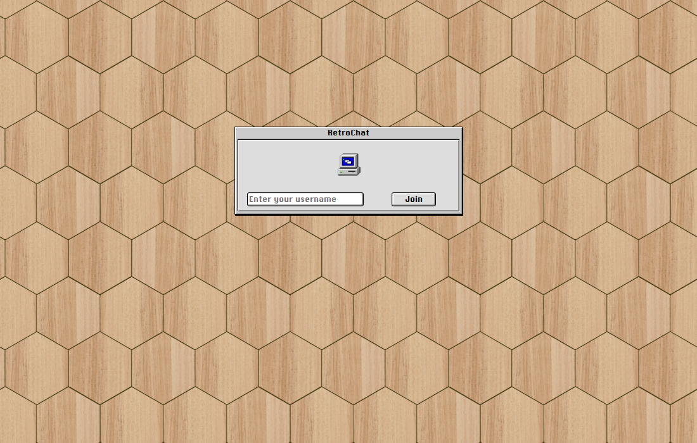
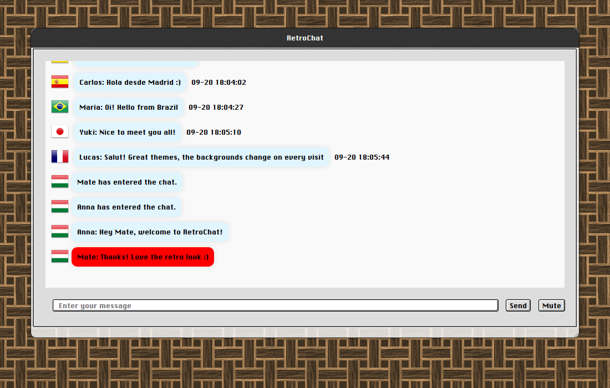

# RetroChat

Globális, valós idejű chatszoba **klasszikus Mac OS 8/9 megjelenéssel**: Chicago betűtípus, domború ablakok, húzható címsorok, kattintás hangeffekt és csempézett háttérképek. Válassz felhasználónevet, csatlakozz a szobához, és beszélgess a világ minden tájáról érkező emberekkel. Minden üzenet mellett az illető országának zászlója látható.

## Demó

| Belépőképernyő | Globális chatszoba |
|---|---|
|  |  |

## Funkciók

- **Valós idejű üzenetküldés** WebSocketen keresztül (Flask-SocketIO)
- **Országzászlók** az üzenetek mellett, a felhasználó IP-címe alapján
- **Retro felület**: Chicago betűtípus, klasszikus ablakkeret, húzható ablakok, kattintás hangeffekt Mute gombbal
- **Véletlenszerű háttér** minden látogatáskor a `static/img/patterns/` mappából
- **Egyedi felhasználónevek**: ha a név foglalt, automatikusan számot kap (`Anna`, `Anna (0)`, `Anna (1)`, ...)
- **Chat előzmények** sima szövegfájlban (`msg.txt`), amelyet az újonnan csatlakozók is látnak
- **Belépési és kilépési értesítések** a szobában
- **Bemenet tisztítása** a [bleach](https://github.com/mozilla/bleach) segítségével

## Technológiák

Python 3 · Flask · Flask-SocketIO · Flask-CORS · bleach · python-dotenv · jQuery / jQuery UI · Socket.IO kliens

## Indítás

```bash
git clone https://github.com/hmate6/socketio-livechat.git
cd socketio-livechat

python -m venv venv
# Windows: venv\Scripts\activate    Linux/macOS: source venv/bin/activate

pip install -r requirements.txt
```

Hozz létre egy `.env` fájlt a projekt gyökerében (a `SECRET_KEY` megadása nem kötelező, lásd lentebb):

```env
HOST_IP=http://127.0.0.1:5000
```

Indítsd el a szervert:

```bash
python main.py
```

Ezután nyisd meg a <http://127.0.0.1:5000> címet, add meg a felhasználóneved, és lépj be. Ha egyedül tesztelsz, nyiss meg egy második böngészőablakot (vagy privát ablakot), és beszélgess saját magaddal.

### Beállítások

| Változó | Leírás |
|---|---|
| `HOST_IP` | A szerver nyilvános címe, ezen keresztül csatlakozik a böngésző a WebSockethez (alapértelmezett: `127.0.0.1:5000`). Ha nem tartalmazza a `127.0.0.1` szöveget, a biztonságos (secure) sütik bekapcsolnak, ehhez HTTPS szükséges. |
| `SECRET_KEY` | A Flask munkamenetek aláírásához használt titkos kulcs. Ha nem adod meg, a program induláskor generál egy véletlenszerűt (újraindításkor új készül, a felhasználóknak ilyenkor újra be kell lépniük). Fix érték megadásához: `python -c "import secrets; print(secrets.token_hex())"`. |

> **Megjegyzés:** az országfelismerés az [ipinfo.io](https://ipinfo.io) szolgáltatást és az `X-Forwarded-For` fejlécet használja, ezért a zászlók akkor jelennek meg helyesen, ha az alkalmazás reverse proxy mögött fut. Localhoston az általános ikon látszik.

## Projektstruktúra

```
socketio-livechat/
├── main.py            # Flask alkalmazás + Socket.IO események
├── get_country.py     # IP-cím -> országkód lekérdezés
├── msg.txt            # Chat előzmények (sima szöveg, induláskor automatikusan létrejön)
├── LICENSE            # MIT licenc
├── templates/
│   ├── index.html     # Belépőképernyő
│   └── ind.html       # Chatszoba
└── static/
    ├── base.css, chat.css
    ├── fonts/         # Chicago FLF betűtípus
    ├── img/           # ikonok, 32x32-es országzászlók, háttérminták
    └── soundeffect/   # kattintás hang
```

## Licenc

Ez a projekt az [MIT licenc](LICENSE) alatt érhető el.

## Köszönet

- Chicago betűtípus: ChicagoFLF, Robin Casady munkája, közkincs (public domain), lásd `static/fonts/README.ChicagoFLF`
- A klasszikus Macintosh felület ihlette
